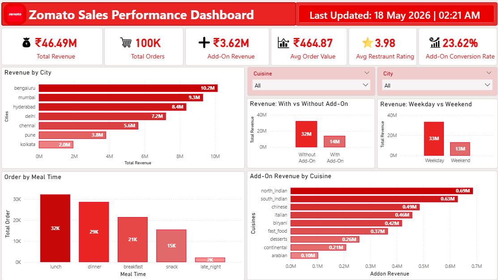
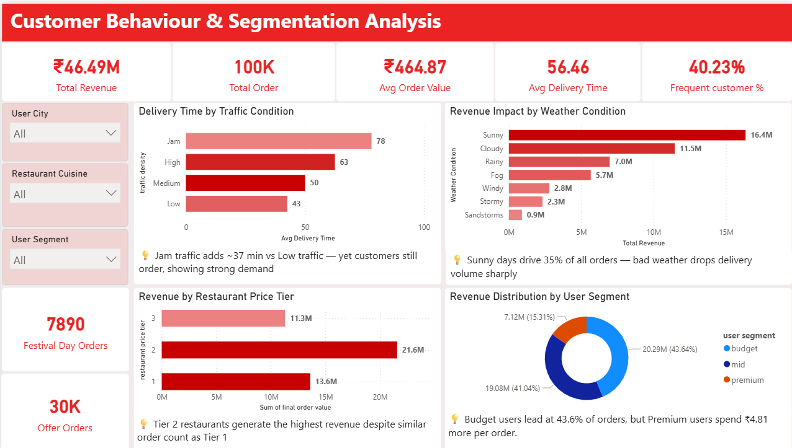

# Food Delivery Sales & Customer Analytics Dashboard

## 📌 Project Overview
An end-to-end data analytics project using a Zomato dataset to analyze sales performance, customer behavior, and business trends through interactive Power BI dashboards.

## 🛠 Tools Used
- Microsoft Excel
- Power BI
- Power Query
- DAX

## 📊 Dashboard Features
- Revenue Analysis
- Customer Segmentation
- City-wise Performance
- Meal Time Trends
- Add-on Behaviour Analysis
- Interactive Filters

## 📈 Key Insights
- Top cities contribute majority revenue
- Lunch and dinner are peak ordering times
- Add-on purchase behavior shows upselling opportunities
- Customer segmentation reveals spending patterns

## 📚 Skills Demonstrated
- Data Cleaning
- Data Visualization
- Dashboard Development
- KPI Creation
- Data Storytelling

## 📊 Dashboard Preview

### Sales Performance Dashboard

### Customer Behaviour & Segmentation Dashboard

